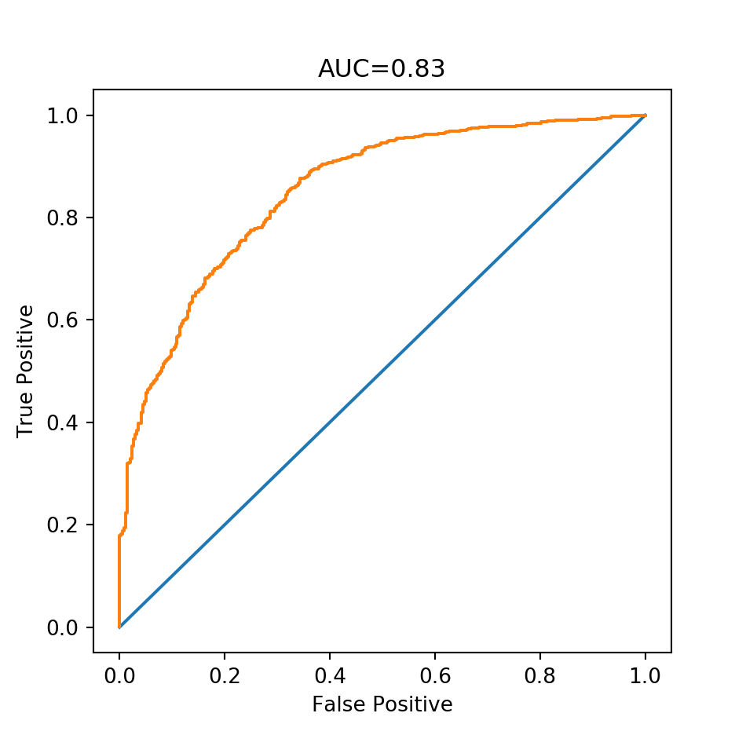

# NYC Fire Map
A map predicting the probability that buildings will catch at least a fire in the following year.

*link: [nycfiremap.com](https://nycfiremap.com/)*

## Data source
- [NYC Fire Incident Dispatch Data](https://data.cityofnewyork.us/Public-Safety/Fire-Incident-Dispatch-Data/8m42-w767)
- [MapPLUTO](https://www1.nyc.gov/site/planning/data-maps/open-data/dwn-pluto-mappluto.page)
- [Housing Maintenance Code Violations](https://data.cityofnewyork.us/browse?q=Housing%20Maintenance%20Code%20Violations&sortBy=relevance)

## Performance

